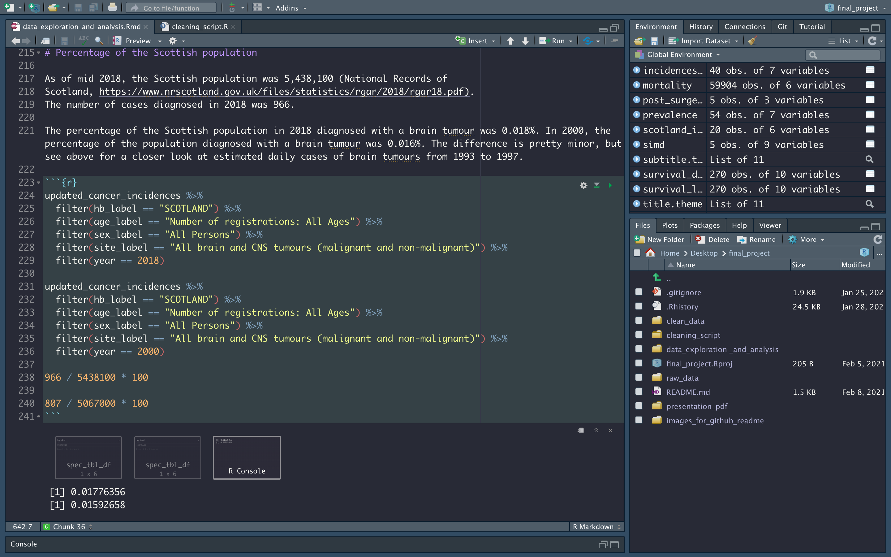
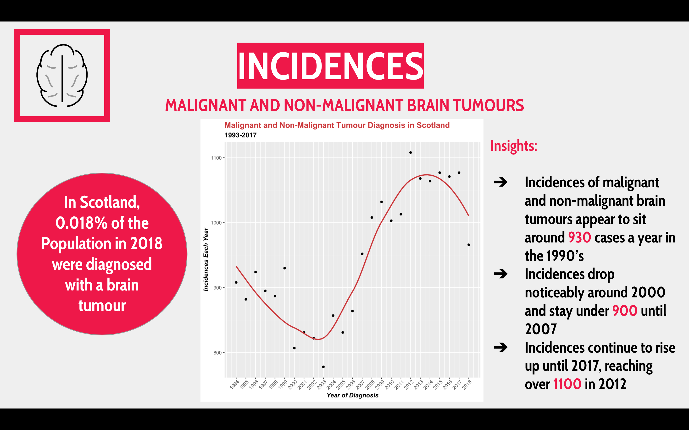

## Final CodeClan Presentation Project 

### The brief 

I was given a charity brief with some specified areas of interest to explore and particular questions to think about answering. The brief specified open source data was to be used and so the raw and clean data are both publically available on my github. The analysis was hopefully going to shed some light on where more education and fundraising resources should be devoted to in Scotland. The infographics should be of good enough quality that they could be incorporated into the charity app if this were a project brief in the real world. 

### Gathering and Cleaninng Data  

The data came from a variety of open sources including Public Health Scotland, NHS audits and National Records of Scotland. The data was all in xlsx format and I saved them as CSVs to export the data into RStudio. The cleaning script can be found on the github repo. Cleaning was relatively simple, mostly a case of pivoting the data into a long format, extracting relevant character strings from the columns and renaming variables.  

### Analysis and Documentation 

I chose to focus on four main areas for my analysis: incidences of brain tumours (both malignant brain tumour incidences and a combination of malignant and non-malignant brain tumours), survival rates (compared to leukaemia survival), mortality (deaths within 10 years of a diagnosis) and patient experiences after surgery. The analysis was typically producing easy to read and clearly documented graphs, calculating informative percentages and identifying any trends in the data. Below is an example of the kind of analysis code I was carrying out. 

 

### Final Presentation and Recommendations 

Here I will provide a short summary of my findings in the areas I chose to focus on. There was an increase in malignant and non-malignant brain tumours incidences across Scotland and England from 1993 until 2017. Survival rates for malignant brain and central nervous system tumours at 1 and 5 years are low, especially when compared to leukaemiia. While the budget for research into brain cancer has grown over the last decade, it still accounts for a relatively small portion of research spending at 6.5% in the 2018/2019 period. Deaths within 10 years of a diagnosis was slightly lower across the 2013-2017 calendar period than the 2008-2012 calendar period. Patient experiences after surgery varied across Scotland, with the areas missing the few specified targets I chose to look at being Aberdeen and Dundee. Overall Scotland met its target that I decided to look at. Below is an example slide of my presentation to give an understanding of how I presented the findings. For a full breakdown and visualisations of my findings see the report above on this repo. 

 
